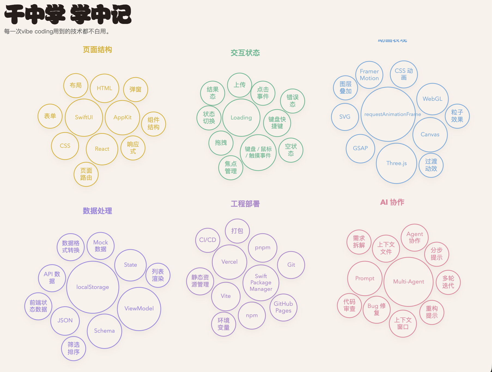

# learn from vibe-coding



作为 0 基础技术小白，每次 vibe coding 过程中会涉及到各种技术术语。每个技术什么意思？能用在哪里？在使用的时候踩过哪些坑？……

它更像一张可以持续生长的技能地图：一边做项目，一边把实际用到的技术点、项目场景和复盘记录沉淀下来。

这个模板的核心方式很简单：
- 在开始一个项目前或项目结束后，加载这个skill，就会帮你更新这个项目涉及到的技术内容，并记录具体使用的项目、功能点
- 用一份统一 JSON 维护技术点
- 用纯静态 HTML / CSS / JavaScript 展示成一张可浏览的技能地图
- 数据存储由你选择， 可存储在飞书多维表格/notion/obisidan里


## 目录

```text
learn-from-vibe-coding/
├── data/
│   └── tech-map-data.json
├── dashboard/
│   ├── index.html
│   ├── style.css
│   └── app.js
├── examples/
│   ├── interactive-writing-demo.json
│   └── grid-game-demo.json
├── docs/
│   └── learn-from-vibe-coding.md
└── README.md
```

## 运行方式

直接双击 `dashboard/index.html` 在部分浏览器里可能会因为本地文件限制导致 JSON 读取失败。更稳的方式是起一个最简单的本地静态服务。

例如：

```bash
cd learn-from-vibe-coding
python3 -m http.server 4173
```

然后打开：

```text
http://127.0.0.1:4173/dashboard/
```

## 部署到 Vercel

这个仓库可以直接按静态站点部署到 Vercel。

建议设置：

- Root Directory：`learn-from-vibe-coding`
- Framework Preset：`Other`
- Build Command：留空
- Output Directory：留空

仓库里已经包含：

- `vercel.json`
- 根路径自动跳转到 `dashboard/` 的 `index.html`

部署完成后，直接打开分配给你的域名即可，不需要再手动补 `/dashboard/`。

## 数据结构

主数据文件是 `data/tech-map-data.json`。

它包含 3 张表：

### `projects`

记录“做过什么项目”。

```json
{
  "id": "sample-project",
  "name": "示例项目",
  "linkOrPath": "https://example.com",
  "reviewedAt": "2026-06-24"
}
```

### `techPoints`

记录“地图上有哪些技术点”。

```json
{
  "id": "canvas",
  "name": "Canvas",
  "island": "动画表现岛",
  "summary": "一句简短说明。",
  "detail": "更完整的解释。",
  "commonForms": "常见落地形态。",
  "stackMappings": "不同技术栈怎么对应。",
  "boundaries": "和相邻概念怎么区分。"
}
```

### `projectTechApplications`

记录“某个项目里具体怎么用了这个技术点”。

```json
{
  "id": "sample-project-canvas",
  "projectId": "sample-project",
  "techPointId": "canvas",
  "roleInProject": "在项目里的作用",
  "aiCollaboration": "和 AI 协作时怎么处理",
  "pitfallsAndFixes": "踩坑与修正",
  "reusable": true,
  "notes": "补充说明"
}
```

## 当前约束

- `techPoints.island` 只能是这 6 个固定值之一：
  - `页面结构岛`
  - `交互状态岛`
  - `动画表现岛`
  - `数据处理岛`
  - `工程部署岛`
  - `AI 协作岛`
- “是否使用”不单独存字段，由前端根据 `projectTechApplications` 是否存在关联自动推导
- `reusable` 只允许 `true`、`false` 或 `null`

## 维护方式

新增内容时，建议按这个顺序维护：

1. 先补 `projects`
2. 再判断项目用了哪些已有 `techPoints`
3. 如果出现新概念，再补新的 `techPoints`
4. 最后补 `projectTechApplications`

也就是说，这个仓库不是只能点亮既有清单，它本身就是可持续增长的地图模板。

## 公开仓库建议

如果你也要把这个模板公开出去，建议保持下面这个习惯：

- `data/tech-map-data.json` 只放你愿意公开的正式数据
- 个人项目样例不要直接放在主数据文件里
- 演示数据放到 `examples/`，或者直接清空主项目记录后再提交

## 示例数据

仓库里保留了两份通用示例数据，便于理解结构：

- `examples/interactive-writing-demo.json`
- `examples/grid-game-demo.json`

它们只是结构示例，不会自动进入主页面。主页面只读取 `data/tech-map-data.json`。

## 说明文档

如果你想看更完整的设计思路和字段讨论，可以继续看：

- `docs/learn-from-vibe-coding.md`
